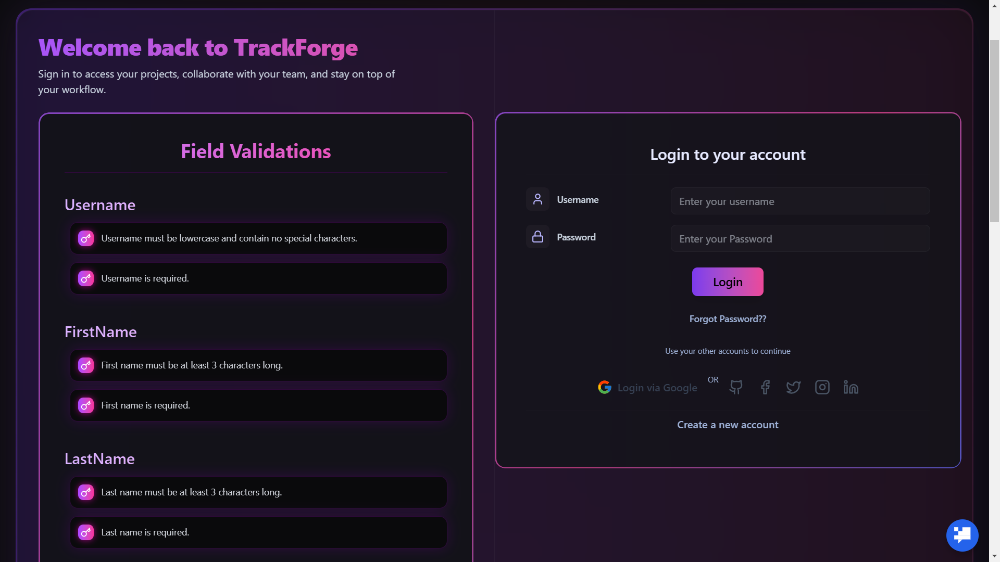
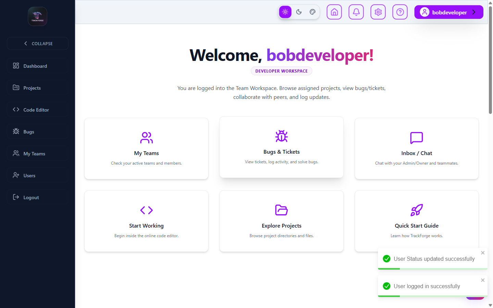
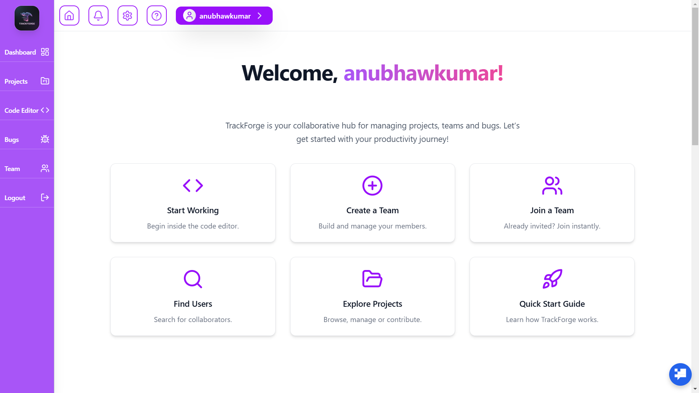
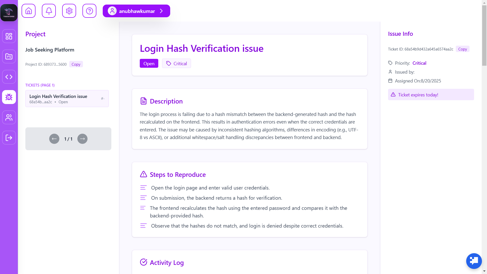
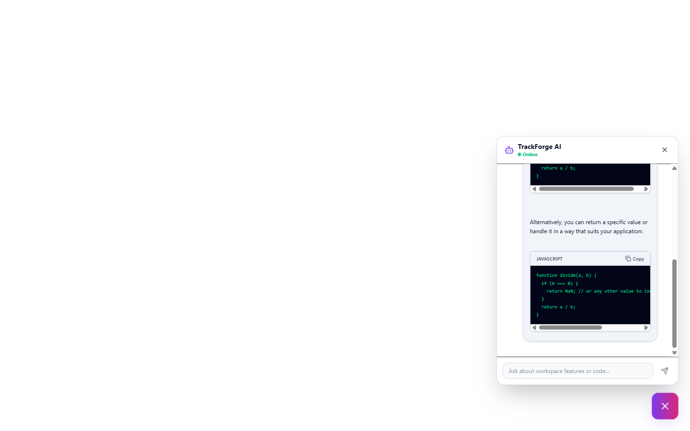
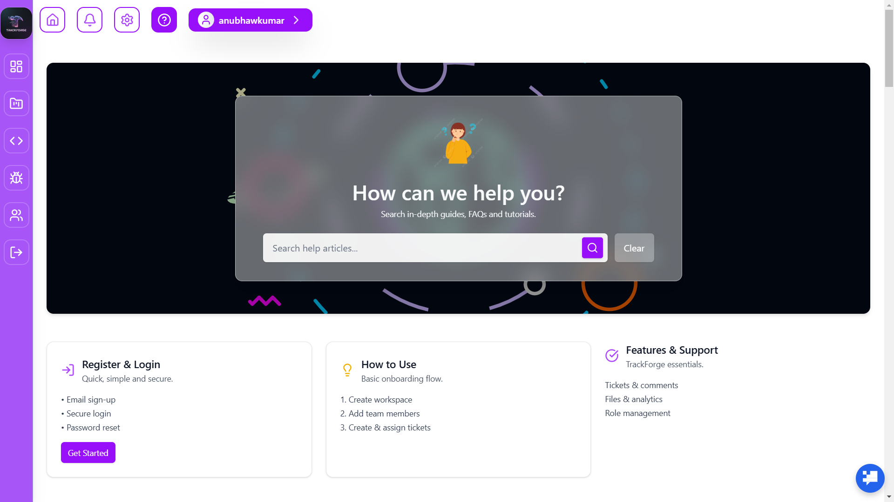

# <div align="center">

# ⚡️ TrackForge

### **Next-Gen Bug Tracking & Team Workflow Platform**

**Neon Purple-Pink Landing Page • SaaS White-Purple Dashboard • AI-Powered Assistant**

<br/>

TrackForge is a modern, lightning-fast, beautifully designed **Bug Tracking SaaS Platform** built for teams, startups, and engineering organizations who want **clarity, speed, and full control** of their development workflow.

</div>


<div>
     <h1>Visit Project :</h1>
     <a>https://trackforge-client-side.onrender.com</a>
</div>

---

# 🌌 **Why TrackForge?**

TrackForge blends **two worlds**:

### 🎨 **1. Futuristic Neon Purple-Pink Landing Page**

A visually striking gateway with:

* Parallax moon component
* Glow effects
* Gradient blurs
* SmokeCursor custom pointer
* Framer Motion scene transitions

### ☁️ **2. Soft White-Purple Premium SaaS Dashboard**

A clean, silky professional UI for real daily use:

* Minimal layout
* Clean typography
* Product-grade UX
* Micro-interactions
* Adaptive color depth

This hybrid design makes TrackForge feel **fun on the outside, powerful on the inside.**

---

# 🔥 **Core Features**

### 🧩 **Project Management**

* Create, delete, and manage multiple projects
* Each project holds members, tickets, roles, analytics
* **Hierarchical File Tree Explorer**: IDE-like vertical workspace directory tree with folders and file-type icons in the code editor.
* **Directory/Folder Uploads**: Multi-level directory uploads that preserve folder structures in MongoDB.
* **CORS Proxy File Loader**: Server-to-server file proxy to fetch and view file contents from Cloudinary without browser CORS blocks.

### 👥 **Teams & Members**

* Role-based permissions (Owners, Admins, Developers, Testers, Debuggers)
* Invite team members & accept join requests
* Workspace-style routing with custom ciphers
* **Direct Messaging / Inbox Chat**: Searchable, split-pane chat interface with real-time messaging, unread notifications, and auto-parsing for meeting invite links.
* **Dynamic Welcome Dashboard**: Quick-action cards tailored specifically by role (Admins see creation and scheduling shortcuts, while Developers see bug trackers, team lists, and project explores).

### 🐞 **Bug Lifecycle Management**

* **Project-Based Bugs Flow**: Structured bugs dashboard with landing projects grid and nested split-pane ticket details.
* Create & assign bugs with priorities (Low / Medium / High / Critical)
* Status flow: `Open → In Progress → Under Review → Resolved → Closed`
* Tagging system, deadline tracking, and activity logging via modals

### 📅 **Scheduled Event Meeting Rooms**

* **Scheduled Rooms**: Admin/Owner can schedule meeting rooms for specific dates/times associated with teams/projects.
* **Time-Locked Chat**: Messaging is locked outside the scheduled calendar date with a visual warning banner.
* **Access Authorization**: Restricted to the organizer, Admin/Owner, or invited team/project/individual users.
* **Inbox Invites & Deduplication**: Dispatches invitation messages directly to invited members' inboxes from the creator, automatically filtering out duplicate listings.
* **Chat Media sharing**: Support for uploading images/files to Cloudinary, rendering inline image previews or download cards.

### 💬 **Comment Threads**

* Internal team discussions, ticket activities, and real-time updates

### 📊 **Analytics Dashboard**

* Ticket volume, project load, priority insights, status breakdown, and developer productivity indicators

### 🤖 **AI-Powered Code Intelligence**

* **AI Chatbot**: Helps with bug explanations, logical suggestions, steps to reproduce, and helps developers understand ticket summaries faster.
* **AI Code Analyzer & Bug Finder**: Integrates deep static analysis directly into the Code Editor page. Use the Gemini model to analyze active files for syntax errors, logical bugs, security vulnerabilities (such as exposed credentials or SQL injection risk), and performance bottlenecks.
* **Auto-Bug Ticket Reporter**: Allows developers to report AI-flagged code issues as full project tickets with a single click. Automatically maps the associated project ID, active file, line range, and severity level, bringing up a spacious modal for assignee mapping and priority designation.

### 🟣 **Framer Motion Everywhere**

* Page transitions
* Element fade-ins
* Parallax interactions
* Smooth dragging
* Animated section mounts/unmounts

### 🔐 **Advanced Security System**

TrackForge uses a custom **64-character cryptographic token** for session isolation.

Example cipher:

```
5f8ee38595405effbdab11e7cd5493c114f2a548ddd059870f07cf902af57adc
```

✔ Length = **64 chars (256-bit)**
✔ Encodes:

* User `_id`
* Login timestamp
* Random cryptographic noise

This is used in URLs like:

```
/auth/{username}/{cipher}/workspace
```

Prevents:

* Duplicate sessions
* Token replay
* Workspace hijacking
* Spoofed user routing

### ⚙️ **Secure Backend**

* Token-based auth
* Sanitized queries
* Encrypted-sensitive storage
* Fast MongoDB aggregation pipelines
* Optimized endpoints

---

# 🧪 **Tech Stack**

### **Frontend**

* React + Vite
* TailwindCSS
* Framer Motion
* Lucide Icons
* Context API
* Socket.io-client (Real-time Messaging)
* Custom Cursor System
* Parallax effects

### **Backend**

* Node.js + Express
* MongoDB + Mongoose
* JWT Authentication
* Socket.io (Real-time Gateway)
* Cloudinary API (Media Cloud Hosting)
* Custom Cipher Generator
* Optimized controllers
* Role-based middleware

---

# 🧭 **Platform Structure**

```
TrackForge
│
├── Landing Page (Neon Theme)
│    ├── Parallax moon
│    └── SmokeCursor
│
├── Workspace (SaaS Dashboard Theme)
│    ├── Projects
│    ├── Tickets
│    ├── Teams
│    ├── Members
│    ├── Analytics
│    └── AI Assistant
│
├── Security Layer
│    └── 256-bit cipher token for workspace session routing
│
└── Backend API
     ├── Auth
     ├── Projects
     ├── Tickets
     ├── Comments
     ├── Teams
     ├── Analytics
     └── Maintenance
```

---


## 📸 Screenshots Overview

TrackForge provides a blend of a neon-themed landing experience and a clean SaaS workspace.  
Here is a structured preview of the platform:

---

## 🟣 Landing & Authentication

<div align="center">

| Intro | Landing | Login |
|-------|---------|--------|
|  |  |  |

</div>

---

## 🧭 Core Workspace

<div align="center">

| Dashboard | Workspace | Project View |
|-----------|-----------|--------------|
|  |  |  |

</div>

---

## 🐞 Bugs, Teams & Notifications

<div align="center">

| Bugs | Teams | Notifications |
|------|--------|---------------|
|  |  |  |

</div>

---

## 🤖 Built-in AI Assistance

<div align="center">

| AI Chatbot | Help Center |
|------------|-------------|
|  |  |

</div>

---


# 📦 **Installation**

### **1. Clone repository**

```bash
git clone https://github.com/yourusername/trackforge.git
cd trackforge
```

### **2. Install client**

```bash
cd client
npm install
```

### **3. Install server**

```bash
cd server
npm install
```

### **4. Configure environment**

Create `.env` files in both folders.

### **5. Start development**

Client:

```bash
npm run dev
```

Server:

```bash
npm start
```

---

# 🌐 **SEO Keywords**

```md
trackforge, bug tracking saas, bug tracker mern, issue tracking platform,
react bug tracker, mern project management tool, neon landing page react,
saas dashboard react, team workflow tool, software bug reporting system,
role based bug tracker, framer motion app, secure bug tracking system,
ai chatbot bug tracking, project management mern
```

---


```md
<!-- 
trackforge, bug tracking, mern bug tracker, project management app,
react tailwind framer motion, neon ui, saas product, workspace routing,
secure token session, developer workflow tool
 -->
```

---

# 📜 **License**

MIT License (or whichever you prefer)

---

# 🎉 **Conclusion**

TrackForge is not just a bug tracker — it is a **complete workspace engine** with a hybrid UI, powerful animations, secure routing, AI assistance, and a premium SaaS experience.

---

#

